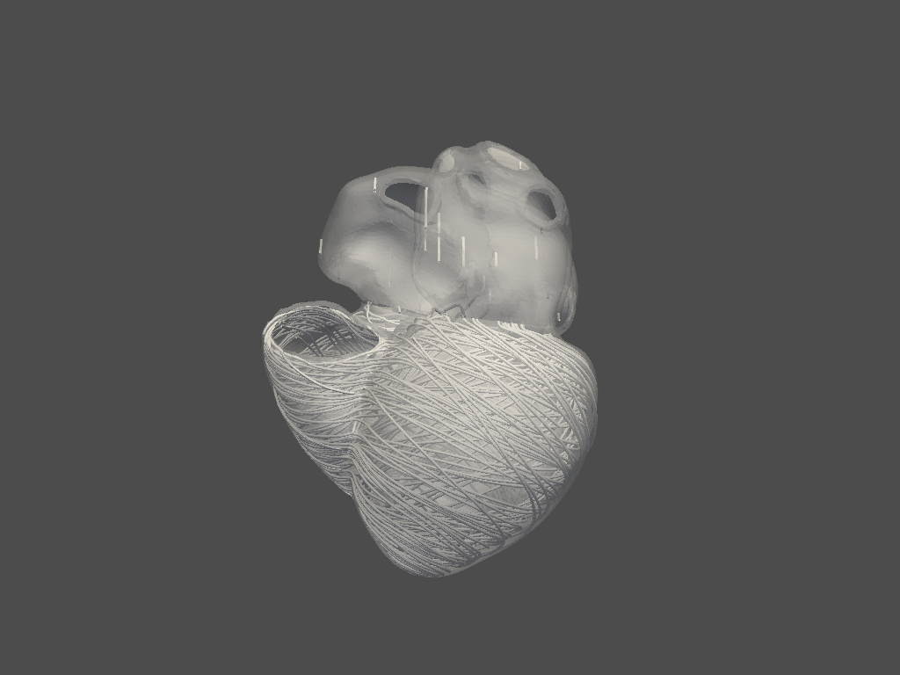

Examples 
========

This page contains examples of pyheart-lib usage.

Downloading a case
^^^^^^^^^^^^^^^^^^
Download and extract a full heart mesh from the public database of 24 pathological hearts
by Strocchi et al (2020).

.. literalinclude:: ../../../examples/heart/preprocessor/example_downloader.py
.. figure:: ../images/mesh.jpg

Pre-process data for heart simulation
^^^^^^^^^^^^^^^^^^^^^^^^^^^^^^^^^^^^^

This example deals with the preprocessing part of the heart simulation

Import all necessary modules from ansys.heart
"""""""""""""""""""""""""""""""""""""""""""""
.. code:: 

    import os
    import pathlib

    import ansys.heart.preprocessor.models as models
    from ansys.heart.simulator.support import run_preprocessor
    import ansys.heart.writer.dynawriter as writers

Initialization of working directories
"""""""""""""""""""""""""""""""""""""
.. code::

    path_to_case = os.path.join(
        pathlib.Path(__file__).parents[3], "downloads\\Strocchi2020\\01\\01.case"
    )
    workdir = os.path.join(pathlib.Path(path_to_case).parent, "BiVentricle")

    path_to_model = os.path.join(workdir, "heart_model.pickle")

Here we have a case from Strocchi2020 database. 
The preprocessor creates a path to a new folder called "BiVentricle" where the preprocessing results will be downloaded.

Preprocessing
"""""""""""""
.. code::

    model = run_preprocessor(
        model_type=models.BiVentricle,
        database="Strocchi2020",
        path_original_mesh=path_to_case,
        work_directory=workdir,
        path_to_model=path_to_model,
        mesh_size=2.0,
    )

run_preprocessor is filled with parameters like the database corresponding to the case studied, the mesh size and the working directories.

Loading the model
"""""""""""""""""
.. code::

    model = models.HeartModel.load_model(path_to_model)
    if not isinstance(model, models.HeartModel):
        exit()
    model.info.workdir = workdir

Can be performed when a model has already been created by the preprocessor. 

Electrophysiology simulation
^^^^^^^^^^^^^^^^^^^^^^^^^^^^

Example of an electrophysiology simulation comprising of: 

1. Computing the fiber orientation

2. Computing and visualizing the Purkinje network

3. Computing the conduction system

4. Starting the main electrophysiology simulation

Load the required modules

.. literalinclude:: ../../../examples/heart/simulator/doc_example_EP_simulator_fourchamber.py
   :start-after: import
   :end-at: ansys.heart.simulator.simulator

Set relevant paths and load four cavity heart model.

.. literalinclude:: ../../../examples/heart/simulator/doc_example_EP_simulator_fourchamber.py
   :start-at: set working directory and path to model
   :end-at: raise TypeError("Expecting a FourChamber heart model.")

Instantiate EP simulator object.

.. literalinclude:: ../../../examples/heart/simulator/doc_example_EP_simulator_fourchamber.py
   :start-at: set base working directory
   :end-before: load default simulation settings

Load default settings.

.. literalinclude:: ../../../examples/heart/simulator/doc_example_EP_simulator_fourchamber.py
   :start-at: load default simulation settings
   :end-at: simulator.settings.load_defaults()

Compute and visualize fiber orientation.

.. literalinclude:: ../../../examples/heart/simulator/doc_example_EP_simulator_fourchamber.py
   :start-at: compute fiber orientation
   :end-at: simulator.model.plot_fibers(n_seed_points=2000)

Compute and visualize Purkinje network and conduction system.

.. literalinclude:: ../../../examples/heart/simulator/doc_example_EP_simulator_fourchamber.py
   :start-at: compute purkinje network
   :end-at: simulator.model.plot_purkinje()

.. figure:: ../images/purkinje.png

Start main electrophysiology simulation

.. literalinclude:: ../../../examples/heart/simulator/doc_example_EP_simulator_fourchamber.py
   :start-at: start main ep-simulation

Post process the EP simulation

Mechanics simulation
^^^^^^^^^^^^^^^^^^^^

Example of a mechanics simulation comprising: 

1. Fiber orientation computation and plot

2. Stress free configuration

3. Mechanics simulation

.. literalinclude:: ../../../examples/heart/simulator/example_simulator_Mechanics.py